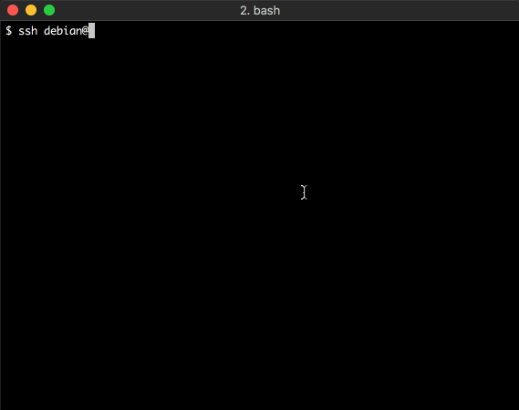

# Olinux-C - Open Linux Containers
## Provide container by ssh.

### How to get an account for Olinux-C
1. Generate a pair of rsa keys (`ssh-keygen -t rsa`)
2. Fork this repo, insert your public key in public_keys/authorized_keys and make a pull request

### Example
#### Simply deploy a new Debian GNU/Linux container
```
ssh debian@olinuxc.org -p 2222
```


#### Deploy an Apache Webserver. Pull code from a Git repo and launch run.sh.
```
export RUN=https://github.com/olinuxc/run_apache_debian.git
ssh debian@olinuxc.org -p 2222 -o SendEnv=RUN
```

##### Provisioning
```
$ ssh debian@olinuxc.org -p 2222 -o SendEnv=RUN
debian@olinuxc.org's password:
Last login: Fri Oct 20 08:00:40 2017 from 192.168.1.1
creating debian container..

you can reach via http your applications at:
http://debian-720658494443.olinuxc.org:443
http://debian-72065849480.olinuxc.org:80
http://debian-7206584948080.olinuxc.org:8080
http://debian-7206584948443.olinuxc.org:8443
```
##### Test your website:

```
$ curl http://debian-72065849480.olinuxc.org:80
welcome to olinuxc!
```

**sending variable RUN execute your scripts at the container startup**


### Available distros

| Distro                           | Docker Image    | Launch command                              |
|:---------------------------------|:----------------|:--------------------------------------------|
|   | debian          | ssh debian@olinuxc.org -p 2222 -i yourkey   |  
|  | ubuntu          | ssh ubuntu@olinuxc.org -p 2222 -i yourkey   |
|| vbatts/slackware| ssh slackware@olinuxc.org -p 2222 -i yourkey|
|   | alpine          | ssh alpine@olinuxc.org -p 2222 -i yourkey   | 
|     | base/archlinux  | ssh arch@olinuxc.org -p 2222 -i yourkey     |
|   | centos7         | ssh centos@olinuxc.org -p 2222 -i yourkey   |
|   | richxsl/rhel7   | ssh rhel@olinuxc.org -p 2222 -i yourkey     |
|   | fedora          | ssh fedora@olinuxc.org -p 2222 -i yourkey   |
|     | mstormo/suse    | ssh suse@olinuxc.org -p 2222 -i yourkey   |
|   | oraclelinux     | ssh oraclelinux@olinuxc.org -p 2222 -i yourkey   |

